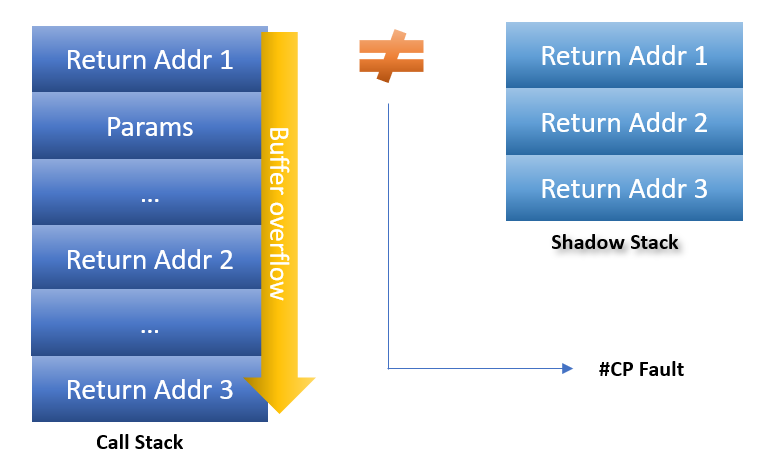

## Introduction

CPUs from every manufacturer (AMD, Intel, Qualcomm, etc.) have CPU-level security features which are utilized by various operating systems. This allows for a hardware security implementation which can provide features such as [hardware-enforced stack protection](https://techcommunity.microsoft.com/blog/windowsosplatform/understanding-hardware-enforced-stack-protection/1247815). The implementations and features vary by CPU manufacturer, and as such this document is an attempt to document the various implementations each CPU manufacturer has taken. Due to the complexity of this topic there is always the possibility that the information is not complete.

## Intel

Intel thankfully makes the security features of their products public and easily accessible. A full list can be found under [Intel's security technologies](https://edc.intel.com/content/www/us/en/design/ipla/software-development-platforms/client/platforms/alder-lake-desktop/12th-generation-intel-core-processors-datasheet-volume-1-of-2/010/security-technologies/) page.

### Intel Control-Flow Enforcement Technology (CET)

For those that want a detailed technical breakdown of Intel's Control-Flow Enforcement Technology, read [Intel's extremely detailed CET article](https://www.intel.com/content/www/us/en/developer/articles/technical/technical-look-control-flow-enforcement-technology.html). The article goes into far more depth than this website.

#### Shadow Stack

Modern Intel CPUs support an additional hardware feature aimed at preventing certain types of return-oriented programming (ROP) and other attacks that target the malicious corruption of the call stack. A shadow stack is a hardware enforced copy of the stack return address that cannot be directly modified by the CPU. When the processor returns from a function call, the return address from the stack is compared against the value from the shadow stack – if the two differ, the process is terminated to prevent a possible ROP attack. 

This hardware feature has been implemented in Windows and Linux, but compiler support is required for the feature to function.

In Windows, the [`/CETCOMPAT` compiler flag](https://learn.microsoft.com/en-us/cpp/build/reference/cetcompat?view=msvc-170) must be enabled in Visual Studio to support this feature. [As of .NET version 9 preview 6 this feature has been enabled by default](https://learn.microsoft.com/en-us/dotnet/core/compatibility/interop/9.0/cet-support). Alternatively, Hardware-Enforced Stack Protection may be enabled on a per-application basis through Windows Defender (App & Browser Control -> Exploit Protection -> Program Settings -> Select Binary -> Enable Hardware-Enforced Stack Protection). For more information on this feature, read Microsoft's wonderful [Understanding Hardware-enforced Stack Protection](https://techcommunity.microsoft.com/blog/windowsosplatform/understanding-hardware-enforced-stack-protection/1247815) blog post.

Intel has a [detailed document](https://lpc.events/event/7/contributions/729/attachments/496/903/CET-LPC-2020.pdf) regarding how support can be added to Linux applications. Due to the complexity of the software compiled for Linux, it is recommended to read this document to get the best understanding of the feature on Linux.

For a visual representation of this feature, see the image below.

[Image Source](https://techcommunity.microsoft.com/blog/windowsosplatform/understanding-hardware-enforced-stack-protection/1247815)

Intel’s Control-Flow Enforcement Technology (CET) uses shadow stacks to ensure the correctness of certain control-flow transfers. Some control-flow transfers update a shadow stack with multiple accesses. Such shadow-stack updates are said to be complex. Certain events encountered during a complex shadow-stack update in a virtual machine may lead to unexpected behavior. Intel has [released a paper](https://www.intel.com/content/www/us/en/content-details/785687/complex-shadow-stack-updates-intel-control-flow-enforcement-technology.html) with recommendations based on new CPU support planned by Intel. 

#### Indirect Branch Tracking

> The ENDBR32 and ENDBR64 (collectively ENDBRANCH) are two new instructions that are used to mark valid indirect CALL/JMP target locations in the program. This instruction is a NOP on legacy processors for backward compatibility.
> 
> The processor implements a state machine that tracks indirect JMP and CALL instructions. When one of these instructions is seen, the state machine moves from IDLE to WAIT_​FOR_​ENDBRANCH state. In WAIT_​FOR_​ENDBRANCH state the next instruction in the program stream must be an ENDBRANCH. If an ENDBRANCH is not seen the processor causes a control protection fault (#CP), otherwise the state machine moves back to IDLE state.
> 
> [source](https://edc.intel.com/content/www/us/en/design/ipla/software-development-platforms/client/platforms/alder-lake-desktop/12th-generation-intel-core-processors-datasheet-volume-1-of-2/006/indirect-branch-tracking/)

### Intel Partner Security Engine (IPSE)

The [Intel Partner Security Engine (IPSE)](https://community.intel.com/t5/Blogs/Tech-Innovation/Client/Intel-Partner-Security-Engine/post/1661658) is responsible for creating a root of trust within a given system, and meeting Microsoft Pluton's security requirements.

## AMD

AMD is unfortunately not good at communicating the security features of their processors. As such, information on AMD processors might be more limited than Intel processors.

### Pluton

Ryzen 6000 series pioneered Pluton capabilities as seen in [the NIST certification](https://csrc.nist.gov/projects/cryptographic-module-validation-program/certificate/4880).

### Shadow Stack

AMD has very little public information about their shadow stack implementation. However, [based on firmware release notes](https://www.amd.com/en/resources/support-articles/release-notes/RN-RYZEN-CHIPSET-6-10-17-152.html) we can confirm that AMD Ryzen 3000 series and newer have shadow stack support.

## Qualcomm

### ARM Pointer Authentication

Qualcomm utilizes [ARM pointer authentication version 8.3](https://www.qualcomm.com/content/dam/qcomm-martech/dm-assets/documents/pointer-auth-v7.pdf) to implement [control-flow integrity (CFI)](https://en.wikipedia.org/wiki/Control-flow_integrity).

### Secure Boot

Qualcomm has an [extremely detailed writeup](https://www.qualcomm.com/content/dam/qcomm-martech/dm-assets/documents/secure-boot-and-image-authentication.pdf) on how their secure boot implementation works.

### Secure Processing Unit (SPU)

While there is no direct documentation from Qualcomm themselves, the SPU is [registered with NIST](https://csrc.nist.gov/CSRC/media/projects/cryptographic-module-validation-program/documents/security-policies/140sp3549.pdf) to showcase its cryptographic capabilities to the public. The SPU is responsible for ensuring secure cryptographic operations for payments, biometrics, and other sensitive data. In the case of Windows, the SPU is what enables [Microsoft Pluton](https://www.microsoft.com/security/blog/2020/11/17/meet-the-microsoft-pluton-processor-the-security-chip-designed-for-the-future-of-windows-pcs/) to function.