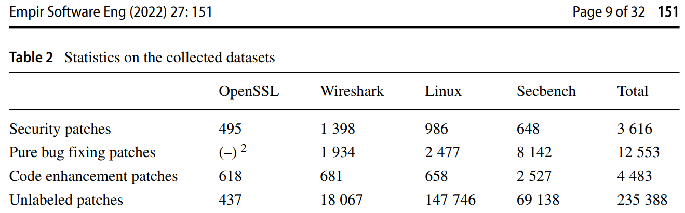
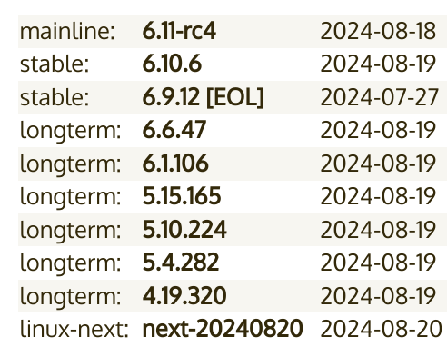

🚨 **These docs are still under active development** 🚨

Linux security has always been a sensitive subject in the industry, and this article will no doubt start some fires.

Before diving into the security practices of the OS, let's make one thing clear. Linux runs our modern world - ChromeOS, Android phones and TVs, cars, fridges, smart devices. It's an amazing operating system and we should all appreciate it for that.

This article is not meant to cause any wars, nor is it meant to call out any individual developers of the operating system. The industry widely accepts that Linux security is fundamentally flawed and needs a serious overhaul to provide the security necessary in today's world. Hopefully, this article will inform both those that are experience with Linux, and those with very little. The hope is to encourage Linux security to be better.

To prevent conflict, as with all other articles on this website, sources will frequently be referenced for all information presented.

## The Distribution Fracturing Problem

The Linux developer ecosystem is unique in many ways, with a culture and practices that differ from every other operating system. This creates a beautiful yet scary environment for reasons we'll discuss in the sections below.

### Stable Release

A large amount of distributions such as Ubuntu, Debian, RHEL, Rocky Linux, Oracle Linux, and CentOS are categorized as "stable release" Linux distributions and always use the long-term support (LTS) kernel. Stable release Linux distributions use outdated packages, only ever backporting security fixes when a CVE has been reported. While this sounds good in practice, a large amount of security vulnerabilities never get assigned a CVE, and as such are never backported to a stable release distribution.

Research from Chainguard in 2024 analyzed over 600 open source projects which [contained over 100 security fixes that were never assigned a CVE](https://www.chainguard.dev/unchained/vulnerability-fixes-in-plain-sight-how-your-scanners-are-missing-hundreds-of-vulnerabilities).

A study from Springer in 2022 found that [37.19% of Linux kernel vulnerabilities never use terminology in the commit log to imply a security fix](https://orbilu.uni.lu/bitstream/10993/54305/1/emse-SSPCatcher-Arthur.pdf). Furthermore, this study shows that 147,746 commits contained the words "bug", "vuln", or "fix", of which only 986 were for known CVEs. It should be noted however that the exact number of commits in this dataset that correlated to fixing a vulnerability is unknown.

A study from North Carolina state university in 2023 created a dataset of the 1000 latest commits in the NPM, Python, Go, PyPI, and Maven projects. They found that [52.86% of projects silently fixed vulnerabilities](https://enck.org/pubs/dunlap-eurosp23.pdf). 

While two of the studies cited do not specifically cover the Linux kernel, they highlight the fact that CVEs are not properly disclosed or reported within the open source community. This is particularly important because of the nature of Linux. Linux is not just a kernel; it's also the set of packages that ship with the kernel in each Linux distribution.

Debian hosts a security tracker which shows [a very large number of vulnerable packages with CVEs that have not yet received a fix](https://security-tracker.debian.org/tracker/status/release/stable).

Ubuntu has a whole blog post explaining how they fix security problems within the distribution and its packages. They have maintainers [manually check the CVE databases to see if packages within Ubuntu are vulnerable, and then manually backport each fix](https://ubuntu.com/blog/securing-open-source-through-cve-prioritisation).

### Duplicated Efforts

At the time of writing, there are 6 LTS kernels and 1 stable kernel.

