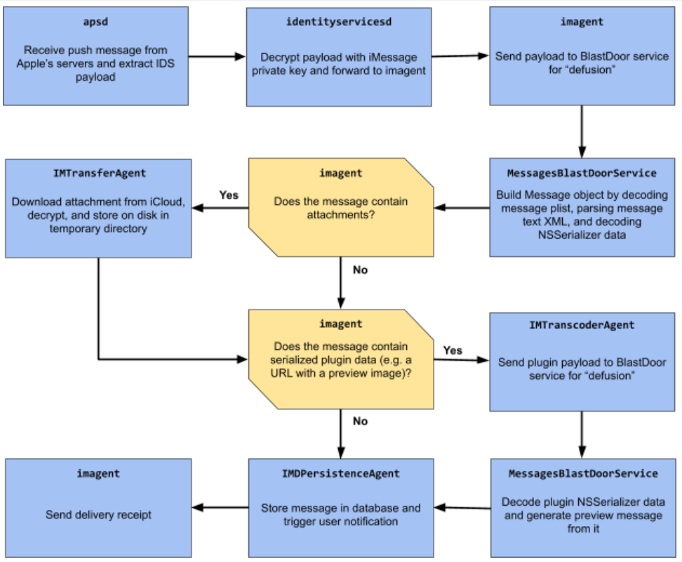
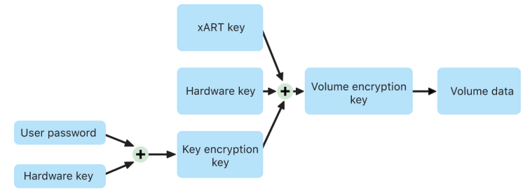
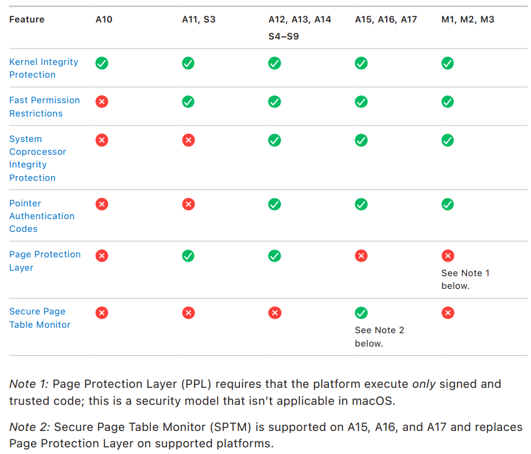
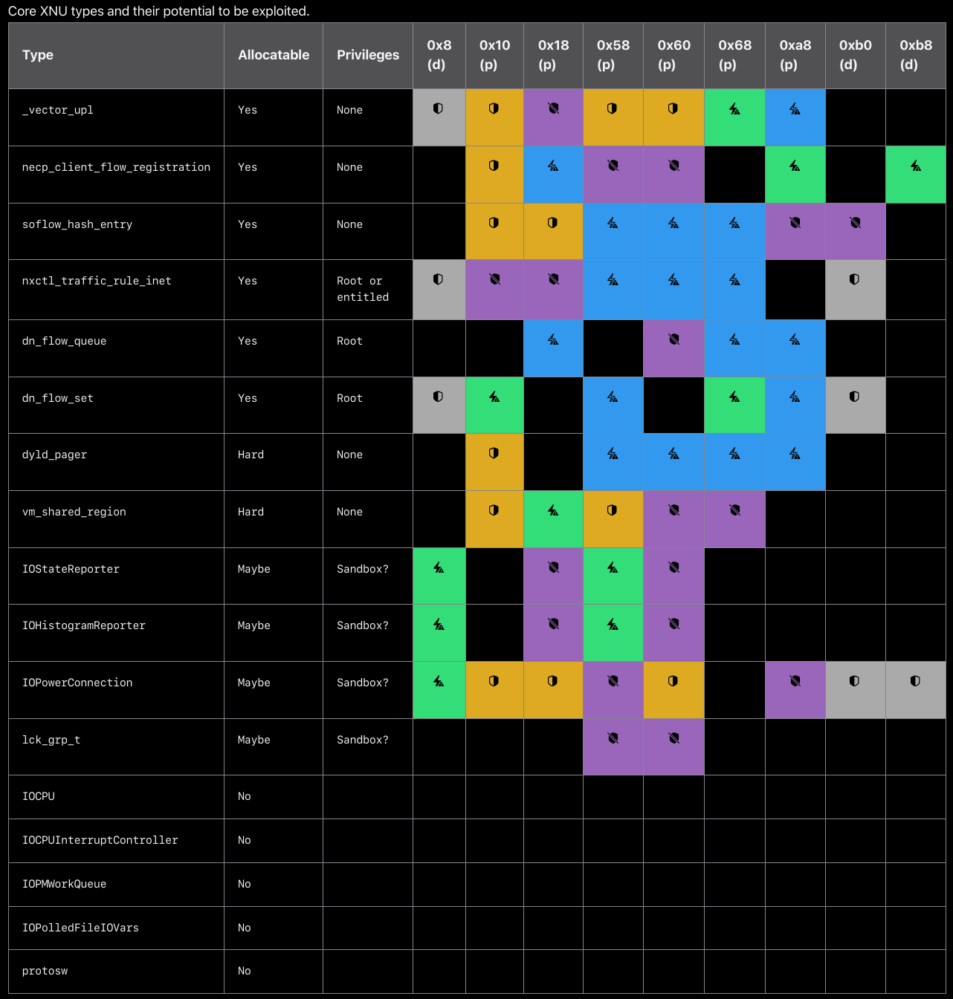

Due to macOS being rather closed down, the information provided is dependent on information Apple has published and findings from security researchers.

These docs are not yet complete, but are a good starting point for those looking to learn more about macOS security.

## BlastDoor

BlastDoor is a feature introduced with iOS 14 which has since been [added to iPadOS, macOS, and watchOS](https://support.apple.com/en-eg/guide/security/secd3c881cee/1/web/1#:~:text=iOS%2C%20iPadOS%2C%20macOS%2C%20and%20watchOS%20include%20a%20security%20feature%20called%20BlastDoor). It was developed due to an NSO exploit used in Pegasus spyware [discovered by Toronto University's Citizenlab](https://citizenlab.ca/2020/12/the-great-ipwn-journalists-hacked-with-suspected-nso-group-imessage-zero-click-exploit/). 

Apple has [implemented BlastDoor in Swift](https://googleprojectzero.blogspot.com/2021/01/a-look-at-imessage-in-ios-14.html#:~:text=Furthermore%2C%20this%20service%20is%20written%20in%20Swift), a memory safe language which significantly reduces the chance of memory corruption vulnerabilities being introduced into the codebase.

In the following image, we see a visual representation of what BlastPass is doing internally. 

[Image from Google's Project Zero Blog](https://googleprojectzero.blogspot.com/2021/01/a-look-at-imessage-in-ios-14.html)

> Historically, ASLR on Apple’s platforms had one architectural weakness: the shared cache region, containing most of the system libraries in a single prelinked blob, was only randomized per boot, and so would stay at the same address across all processes. This turned out to be especially critical in the context of 0-click attacks, as it allowed an attacker, able to remotely observe process crashes (e.g. through timing of automatic delivery receipts), to infer the base address of the shared cache and as such break ASLR, a prerequisite for subsequent exploitation steps.
> 
> However, with iOS 14, Apple has added logic to specifically detect this kind of attack, in which case the shared cache is re-randomized for the targeted service the next time it is started, thus rendering this technique useless. This should make bypassing ASLR in a 0-click attack context significantly harder or even impossible (apart from brute force) depending on the concrete vulnerability.
> 
> [source](https://googleprojectzero.blogspot.com/2021/01/a-look-at-imessage-in-ios-14.html#:~:text=2.%20Re%2Drandomization%20of%20the%20Dyld%20Shared%20Cache%20Region)

> To limit an attacker’s ability to retry exploits or brute force ASLR, the BlastDoor and imagent services are now subject to a newly introduced exponential throttling mechanism enforced by launchd, causing the interval between restarts after a crash to double with every subsequent crash (up to an apparent maximum of 20 minutes). With this change, an exploit that relied on repeatedly crashing the attacked service would now likely require in the order of multiple hours to roughly half a day to complete instead of a few minutes.
> 
> [source](https://googleprojectzero.blogspot.com/2021/01/a-look-at-imessage-in-ios-14.html#:~:text=3.%20Exponential%20Throttling%20to%20Slow%20Down%20Brute%20Force%20Attacks)

## Direct Memory Access

> Apple systems on chip contain an Input/Output Memory Management Unit (IOMMU) for each DMA agent in the system, including PCIe and Thunderbolt ports. Because each IOMMU has its own set of address translation tables to translate DMA requests, peripherals connected by PCIe or Thunderbolt can access only memory that has been explicitly mapped for their use. Peripherals cannot access memory belonging to other parts of the system—such as the kernel or firmware—memory assigned to other peripherals. If an IOMMU detects an attempt by a peripheral to access memory that is not mapped for that peripheral’s use, it triggers a kernel panic.
> 
> [source](https://support.apple.com/en-eg/guide/security/seca4960c2b5/1/web/1)

## FileVault

> FileVault on a Mac with Apple Silicon is implemented using Data Protection Class C with
a volume key. On a Mac with Apple Silicon and a Mac with an Apple T2 Security Chip,
encrypted internal storage devices directly connected to the Secure Enclave leverage
its hardware security capabilities as well as that of the AES engine. After a user turns on
FileVault on a Mac, their credentials are required during the boot process.
> 
> Without valid login credentials or a cryptographic recovery key, the internal APFS volumes
remain encrypted and are protected from unauthorized access even if the physical storage
device is removed and connected to another computer. In macOS 10.15, this includes
both the system volume and the data volume. Starting in macOS 11, the system volume
is protected by the signed system volume (SSV) feature, but the data volume remains
protected by encryption. Internal volume encryption on a Mac with Apple Silicon as well as
those with the T2 chip is implemented by constructing and managing a hierarchy of keys,
and builds on the hardware encryption technologies built into the chip. This hierarchy of
keys is designed to simultaneously achieve four goals:
> 
> • Require the user’s password for decryption
> 
> • Protect the system from a brute-force attack directly against storage media removed
from Mac
> 
> • Provide a swift and secure method for wiping content via deletion of necessary
cryptographic material
> 
> • Enable users to change their password (and in turn, the cryptographic keys used to
protect their files) without requiring reencryption of the entire volume
> 
> 
> 
> On a Mac with Apple Silicon a Mac with a T2 chip, all FileVault key handling occurs in the
Secure Enclave; encryption keys are never directly exposed to the Intel CPU. By default,
all APFS volumes are created with a volume encryption key. Volume and metadata contents
are encrypted with this volume encryption key, which is wrapped with a key encryption key
(KEK). The KEK is protected by a combination of the user’s password and hardware UID
when FileVault is turned on.
> 
> [source](https://help.apple.com/pdf/security/en_US/apple-platform-security-guide.pdf), page 108-109

## Gatekeeper

Gatekeeper is an endpoint protection software which verifies that applications running on macOS are:

- Signed by a developer ID issued by Apple
- Notarized by Apple to be free of known malicious content
- The application has not been altered

## Lockdown Mode

While we do not know all the details regarding lockdown mode, we can infer a lot of information about it. To quote Apple:

> Lockdown Mode makes tradeoffs for increased security at the expense of functionality,
performance, or both. These tradeoffs impact:
> 
> • Background services
> 
> • Connectivity
> 
> • Device management
> 
> • FaceTime
> 
> • GameCenter
> 
> • Mail
> 
> • Messages
> 
> • Photos
> 
> • Safari
> 
> • System settings
> 
> • WebKit
>
> [source](https://support.apple.com/en-ca/guide/security/sec2437264f0/1/web/1#:~:text=Lockdown%20Mode%20makes,WebKit)

While lockdown mode is in use, quite a few restrictions become obvious to the end user. iMessage no longer supports games or certain file formats, some website images may not load due to their file type, 2G cell networks will be unreachable, some apps and websites may not work properly. However, we do not currently know the specifics; which image types are blocked, what causes some JavaScript to break, etcetera. 

That being said, at the time of writing in August of 2024, there are currently no known cases of spyware infecting an Apple device which has lockdown mode enabled. Lockdown mode being this effective is quite impressive; it goes to show that reducing attack surface goes a long way to improving security.

## Secure Boot

When a mac boots, it goes through the following process.

[Image from Apple's security documentation](https://help.apple.com/pdf/security/en_US/apple-platform-security-guide.pdf), page 33

> The chip executes code from the Boot ROM in the first step in the chain of trust. macOS
secure boot on a Mac with Apple silicon verifies not only the operating system code itself,
but also the security policies and even kexts (supported, though not recommended)
configured by authorized users.
> 
> When LLB (which stands for Low Level Bootloader) is launched, it then verifies the
signatures and loads system-paired firmware for intra-SoC cores such as the storage,
display, system management, and Thunderbolt controllers. LLB is also responsible for
loading the LocalPolicy, which is a file signed by the Secure Enclave Processor.
The LocalPolicy file describes the configuration that the user has chosen for the system
boot and runtime security policies. The LocalPolicy has the same data structure format as
all other boot objects, but it’s signed locally by a private key that’s available only within
a particular computer’s Secure Enclave instead of being signed by a central Apple server
(like software updates).
> 
> To help prevent replay of any previous LocalPolicy, LLB must look up an anti-replay
value from the Secure Enclave–attached Secure Storage Component. To do this, it uses
the Secure Enclave Boot ROM and makes sure the anti-replay value in the LocalPolicy
matches the anti-replay value in the Secure Storage Component. This helps prevent an old
LocalPolicy—which could have been configured for lower security—from being reapplied to
the system after security has been upgraded. The result is that secure boot on a Mac with
Apple silicon helps protect not only against rollback of operating system versions but also
against security policy downgrades.
> 
> The LocalPolicy file captures whether the operating system is configured for Full, Reduced,
or Permissive security.
> 
> • Full Security: The system behaves like iOS and iPadOS, and allows only booting
software which was known to be the latest that was available at install time.
> 
> • Reduced Security: LLB is directed to trust “global” signatures, which are bundled with
the operating system. This allows the system to run older versions of macOS. Because
older versions of macOS inevitably have unpatched vulnerabilities, this security mode
is described as Reduced. This is also the policy level required to support booting kernel
extensions (kexts).
> 
> • Permissive Security: The system behaves like Reduced Security in that it uses global
signature verification for iBoot and beyond, but it also tells iBoot that it should accept
some boot objects being signed by the Secure Enclave with the same key used to sign
the LocalPolicy. This policy level supports users that are building, signing, and booting
their own custom XNU kernels.
> 
> If the LocalPolicy indicates to LLB that the selected operating system is running in Full
Security, LLB evaluates the personalized signature for iBoot. If it’s running in Reduced
Security or Permissive Security, it evaluates the global signature. Any signature verification
errors cause the system to boot to recoveryOS to provide repair options.
> 
> After LLB hands off to iBoot, it loads macOS-paired firmware such as that for the
Secure Neural Engine, the Always On Processor, and other firmware. iBoot also looks at
information about the LocalPolicy handed to it from LLB. If the LocalPolicy indicates that
there should be an Auxiliary Kernel Collection (AuxKC), iBoot looks for it on the file system,
verifies that it was signed by the Secure Enclave with the same key as the LocalPolicy,
and verifies that its hash matches a hash stored in the LocalPolicy. If the AuxKC is verified,
iBoot places it into memory with the Boot Kernel Collection before locking the full memory
region covering the Boot Kernel Collection and AuxKC with the System Coprocessor
Integrity Protection (SCIP). If the policy indicates that an AuxKC should be present but it
isn’t found, the system continues to boot into macOS without it. iBoot is also responsible
for verifying the root hash for the signed system volume (SSV), to check that the file
system the kernel will mount is fully integrity verified.
> 
> [source](https://help.apple.com/pdf/security/en_US/apple-platform-security-guide.pdf), pages 33-34

## System Integrity Protection (SIP)

> macOS utilizes kernel permissions to limit writability of critical system files with a feature
called System Integrity Protection (SIP). This feature is separate and in addition to the
hardware-based Kernel Integrity Protection (KIP) available on a Mac with Apple silicon,
which protects modification of the kernel in memory. Mandatory access control technology
is leveraged to provide this and a number of other kernel level protections, including
sandboxing and Data Vault.
> 
> [source](https://help.apple.com/pdf/security/en_US/apple-platform-security-guide.pdf), page 69

## SoC Security

Apple's silicon has built-in security features which are detailed in the chart below.

## Sandboxing

## XNU (MacOS Kernel)

Like most kernels in production today, XNU is built using C and C++; two languages known for being unsafe. Unfortunately, due to how large and complex kernels can be, it is not trivial to rewrite kernels in a safer language. 

As a compromise, many companies have instead begun opting for hardened memory allocators and type isolation. While it is not a perfect solution, it does substantially improve the security of kernels and is a good first step to take while safer languages are being adopted.

### kalloc_type

`Kalloc_type` is a hardened memory allocator developed by Apple which was first [released with iOS 15](https://security.apple.com/blog/towards-the-next-generation-of-xnu-memory-safety/#:~:text=We%20first%20shipped%20this%20new%20hardened%20allocator%2C%20called%20kalloc_type%2C%20in%20iOS%2015%2C%20and%20this%20year%20we%E2%80%99ve%20expanded%20its%20use%20across%20our%20systems.) with the primary goal of providing a means of type isolation in the existing kernel code. It has since been rolled out to every OS that Apple develops.

Within the context of XNU, type confusion was utilized in [almost all attacks](https://googleprojectzero.blogspot.com/2020/06/a-survey-of-recent-ios-kernel-exploits.html) to ultimately achieve arbitrary code execution. `Kalloc_type` was developed due the lack of specialized hardware assistance such as ARM's memory tagging extensions (MTE). The next best mitigation strategy for temporal memory issues was type isolation and sequestering.

> As a rough approximation for the set of all 194 types, the table below displays all core XNU types that could ever colocate with ip6_pktopts and also the fields of each that could potentially be useful for an exploit. The “Allocatable” column describes whether userspace can allocate instances of this type, and the “Privileges” column describes any special privileges needed to do so. The other columns represent the fields of ip6_pktopts, and the color of each cell represents how the type confusion would manipulate the overlapped field of the replacement type. All empty cells were deemed uninteresting.

[Images from Apple's security blog](https://security.apple.com/blog/what-if-we-had-sockpuppet-in-ios16/#:~:text=Core%20XNU%20types%20and%20their%20potential%20to%20be%20exploited.)

According to Apple's internal testing:

> If we do the math, we’d need 15 candidates for a 75% chance of collision and 30 candidates for a 95% chance of collision. That is, if you wanted your exploit to succeed at least 95% of the time, you’d need to write code to allocate 30 different types from the available signature groups, corrupt 30 different fields using the ip6_pktopts primitives, and then from each of those slightly different corrupted states build a useful kernel write primitive — all while knowing that you'll learn which of those 30 candidates will actually work on the target device only after the exploit starts running.
> 
> [source](https://security.apple.com/blog/what-if-we-had-sockpuppet-in-ios16/#:~:text=If%20we%20do,exploit%20starts%20running.)

It's strongly recommended to read Apple's full writeup on [XNU memory safety](https://security.apple.com/blog/towards-the-next-generation-of-xnu-memory-safety/) and how it has impacted the security of Apple's products in their [SockPuppet blog post](https://security.apple.com/blog/what-if-we-had-sockpuppet-in-ios16/). This section of Netrunner Academy only discusses a tiny fraction of what is discussed within those two blog posts.

## XProtect

> macOS includes built-in antivirus technology called XProtect for the signature-based
detection and removal of malware. The system uses YARA signatures, a tool used to
conduct signature-based detection of malware, which Apple updates regularly.
Apple monitors for new malware infections and strains, and updates signatures
automatically—independent from system updates—to help defend a Mac from malware
infections. XProtect automatically detects and blocks the execution of known malware.
In macOS 10.15 or later, XProtect checks for known malicious content whenever:
• An app is first launched
• An app has been changed (in the file system)
• XProtect signatures are updated
When XProtect detects known malware, the software is blocked and the user is notified
and given the option to move the software to the Trash.
> 
> [source](https://help.apple.com/pdf/security/en_US/apple-platform-security-guide.pdf), page 131

Despite XProtect sounding amazing for end users, some have [rightfully criticized Apple's approach](https://www.sentinelone.com/blog/mac-admins-why-apples-silent-approach-to-endpoint-security-should-be-a-wake-up-call/). Apple has a tendency to silently update XProtect's signatures, but [often lags behind](https://www.sentinelone.com/blog/macos-cuckoo-stealer-ensuring-detection-and-defense-as-new-samples-rapidly-emerge/) the latest malware targeting macOS. There are many cases where bad actors have outright [bypassed XProtect signature updates within days](https://www.sentinelone.com/blog/macos-adload-prolific-adware-pivots-just-days-after-apples-xprotect-clampdown/) of them being rolled out.