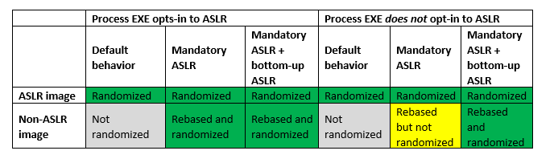

import { Aside } from '@astrojs/starlight/components';

## Exploit Mitigations

Exploit mitigations aim to eliminate entire classes of common vulnerabilities and exploit techniques, thereby preventing or significantly hindering exploitation. Windows includes numerous built-in mitigations, which we will explore in more detail below.

Before delving into the specifics of Windows exploit mitigations, it’s crucial to understand their importance. Industry research indicates that 60-90% of vulnerabilities are caused by memory safety issues, depending on the product.[1](https://www.memorysafety.org/docs/memory-safety/#how-common-are-memory-safety-vulnerabilities) Microsoft's own research reveals that approximately 70% of vulnerabilities in Windows are related to memory safety issues.[2](https://msrc.microsoft.com/blog/2019/07/we-need-a-safer-systems-programming-language/) To address these problems, most Windows exploit mitigations are designed to prevent memory safety-related security issues.

Below is a chart detailing the various exploit mitigations available in Windows, their default settings, and their scope.

| Exploit Mitigations        | Default Setting  | Scope        |
|----------------------------|------------------|--------------|
| Control Flow Guard         | On               | System-Wide  | 
| Data Execution Prevention  | On               | System-Wide  |
| Mandatory ASLR             | Off              | System-Wide  |
| Bottom-up ASLR             | On               | System-Wide  |
| High Entropy ASLR          | On               | System-Wide  |
| SEHOP                      | On               | System-Wide  |
| Heap Integrity Validation  | On               | System-Wide  |

Let's explore each of these exploit mitigations and their implications for security on Windows.

## Control Flow Guard (CFG)

> Control Flow Guard (CFG) is a highly-optimized platform security feature that was created to combat memory corruption vulnerabilities. By placing tight restrictions on where an application can execute code from, it makes it much harder for exploits to execute arbitrary code through vulnerabilities such as buffer overflows. CFG extends previous exploit mitigation technologies such as [/GS](https://learn.microsoft.com/en-us/cpp/build/reference/gs-buffer-security-check?view=msvc-170), [DEP](#data-execution-prevention), and [ASLR](#address-space-layout-randomization-aslr).
>
> - Prevent memory corruption and ransomware attacks.
> - Restrict the capabilities of the server to whatever is needed at a particular point in time to reduce attack surface.
> - Make it harder to exploit arbitrary code through vulnerabilities such as buffer overflows.
>
> [source](https://learn.microsoft.com/en-us/windows/win32/secbp/control-flow-guard#how-does-cfg-really-work)

## Data Execution Prevention

> Data Execution Prevention (DEP) is a technology built into Windows that helps protect you from executable code launching from places it's not supposed to. DEP does that by marking some areas of your PC's memory as being for data only, no executable code or apps will be allowed to run from those areas of memory.
>
> This is designed to make it harder for attacks that try to use buffer overflows, or other techniques, to run their malware from those parts of memory that normally only contain data.
>
> [source](https://support.microsoft.com/en-us/topic/what-is-data-execution-prevention-dep-60dabc2b-90db-45fc-9b18-512419135817)

## Address Space Layout Randomization (ASLR)

> Address space layout randomization (ASLR) is a computer security technique involved in preventing exploitation of memory corruption vulnerabilities. In order to prevent an attacker from reliably redirecting code execution to, for example, a particular exploited function in memory, ASLR randomly arranges the address space positions of key data areas of a process, including the base of the executable and the positions of the stack, heap and libraries.
>
> [source](https://en.wikipedia.org/wiki/Address_space_layout_randomization)

Windows has three ASLR settings.

<Aside>Windows ASLR has some oddities which might be important to know if security is critical for you or your workplace. See [ASLR Oddities](#aslr-oddities) for more information.</Aside>

### Mandatory ASLR

By default, Windows only enables ASLR for executables and DLLs which opt-in by linking with the `/DYNAMICBASE` flag. This flag has been enabled by default since Visual Studio 2010, but it's still possible for applications to opt out to avoid non-trivial compatibility issues with existing applications.[3](https://msrc.microsoft.com/blog/2017/11/clarifying-the-behavior-of-mandatory-aslr/)

Mandatory ASLR forcibly rebases all executables and DLLs that have not opted in. This can be forced on a per-application basis or system-wide.

Microsoft disables this by default within Windows to prevent compatibility issues with executable files.

### Bottom-up ASLR

Bottom-up ASLR employs randomization during memory allocation, making the base addresses for the heap, stack, and other program segments unpredictable. This thwarts attackers exploiting vulnerabilities that depend on predetermined memory locations.[4](https://msrc.microsoft.com/blog/2017/11/clarifying-the-behavior-of-mandatory-aslr/)

Bottom-up ASLR requires an application to be linked with the `/DYNAMICBASE` flag. Bottom-up ASLR will apply to all executables if [Mandatory ASLR](#mandatory-aslr) is enabled.

The image below helps visualize how and when ASLR applies to applications.

### High Entropy ASLR

The `/HIGHENTROPYVA` and `/LARGEADDRESSAWARE` compiler flags specify support for high-entropy 64-bit ASLR. This means that the executable image can utilize a larger address space for randomization, leading to higher entropy. However, it's important to note that if an application saves pointers in 32-bit variables, using high entropy could potentially truncate the 64-bit address, leading to application crashes. This issue is more likely with older programs that are not linked with the `/dynamicbase` linker option.[5](https://learn.microsoft.com/en-us/cpp/build/reference/highentropyva?view=msvc-170)

Let's take a look at why this matters.

> Prior to Windows 8, 64-bit executable images received the same amount of entropy that was used when randomizing 32-bit executable images (8 bits, or 1 in 256 chance of guessing correctly). The amount of entropy applied to 64-bit images has been significantly increased in most cases starting with Windows 8:
> 
> DLL images based above 4 GB: 19 bits of entropy (1 in 524,288 chance of guessing correctly)
> DLL images based below 4 GB: 14 bits of entropy (1 in 16,384 chance of guessing correctly).
> EXE images based above 4 GB: 17 bits of entropy (1 in 131,072 chance of guessing correctly).
> EXE images based below 4 GB: 8 bits of entropy (1 in 256 chance of guessing correctly).
> 
> [source](https://msrc.microsoft.com/blog/2013/12/software-defense-mitigating-common-exploitation-techniques/)

According to Microsoft's documentation, not utilizing high entropy ASLR allows an attacker a 1 in 256 chance of correctly guessing a memory address, potentially leading to exploitation. High entropy ASLR significantly decreases the probability of an attacker successfully guessing the correct memory address.

High entropy ASLR applies to all executables protected by Bottom-Up ASLR, either through the executable opting into the `/dynamicbase` linker option or by the user enabling [Mandatory ASLR](#mandatory-aslr).

## ASLR Oddities

Windows ASLR does not behave as one would expect. All of these odd behaviours are documented in their respective subsections

### Windows 10 Aggressively Reuses Memory Addresses

> Observe that even if a Windows system must ensure that multiple instances of one DLL or EXE all get loaded at the same base address, the system need not keep track of the base address once the last instance of the DLL or EXE is unloaded. If the DLL or EXE is loaded again, it can get a fresh base address.
>
> This is the behavior we observed in working with Windows 7. Windows 10 can work differently. Even after the last instance of a DLL or EXE unloads, it may maintain the same base address at least for a short period of time—more so for EXEs than DLLs. This can be observed when repeatedly launching a command-line utility under a multi-process debugger. However, if the utility is copied to a new filename and then launched, it receives a fresh base address. Likewise, if a sufficient duration has passed, the utility will load at a different base address. Rebooting, of course, generates fresh base addresses for all DLLs and EXEs.
>
> [Source](https://cloud.google.com/blog/topics/threat-intelligence/six-facts-about-address-space-layout-randomization-on-windows)

There is currently no information on whether this applies to Windows 11. To be safe, assume Windows 11 behaves the same as Windows 10.

### Windows Hibernate and Sleep Modes May Reuse Memory Addresses

#### Hibernation

In Windows there is a setting known as Fast Startup which allows for your computer to start up faster after a shutdown. Windows accomplishes this by utilizing hibernation.

Hibernation works by saving a `Hiberfil.sys` system file to the root of the drive where the operating system is installed. The `Hiberfil.sys` file stores a copy of the system memory onto the drive every time your computer enters hibernation. This means that booting from hibernation allows Windows to reuse the same memory addresses for processes that were running before entering hibernation.[6](https://learn.microsoft.com/en-us/troubleshoot/windows-client/setup-upgrade-and-drivers/disable-and-re-enable-hibernation#more-information)

#### Sleep

Windows sleep mode is similar to hibernation, but it keeps all processes running in RAM rather than saving RAM to the disk. This means that booting from sleep allows Windows to reuse the same memory addresses for processes that were running before entering sleep.

## Structured Exception Handling Overwrite Protection (SEHOP)

> Structured Exception Handling Overwrite Protection (SEHOP) helps prevent attackers from being able to use malicious code to exploit the Structured Exception Handling (SEH), which is integral to the system and allows (non-malicious) apps to handle exceptions appropriately. Because this protection mechanism is provided at run-time, it helps to protect applications regardless of whether they've been compiled with the latest improvements.
> 
> [source](https://learn.microsoft.com/en-us/windows/security/threat-protection/overview-of-threat-mitigations-in-windows-10#structured-exception-handling-overwrite-protection)

## Validate Heap Integrity

Validate Heap Integrity is a straightforward yet effective exploit mitigation. When heap corruption is detected in any application, the application is automatically terminated. If enabled, this measure applies universally to all applications.

## App-Level Mitigation Settings

Windows offers numerous additional exploit mitigations that can significantly enhance its security. However, these settings are only configurable on a per-application basis and cannot be enabled system-wide. Users can configure these mitigations through PowerShell or the Windows Defender GUI, but applications themselves cannot automatically opt in to these protections.

Because these settings must be configured individually for each application, requiring the specific path for each one, comprehensive documentation on these exploit mitigations will not be provided by Netrunner Academy.

| Exploit Mitigations                 | Scope     |
|-------------------------------------|-----------|
| Arbitrary Code Guard                | App Level |
| Block Low Integrity Images          | App Level |
| Block Remote Images                 | App Level |
| Block Untrusted Fonts               | App Level |
| Code Integrity Guard                | App Level |
| Disable Extension Points            | App Level |
| Disabled Win32k Calls               | App Level |
| Don't Allow Child Processes         | App Level |
| Export Address Filtering            | App Level |
| Import Address Filtering            | App Level |
| Simulate Execution                  | App Level |
| Validate API Invocation             | App Level |
| Validate Handle Usage               | App Level |
| Validate Image Dependency Integrity | App Level |
| Validate Stack Integrity            | App Level |

## 